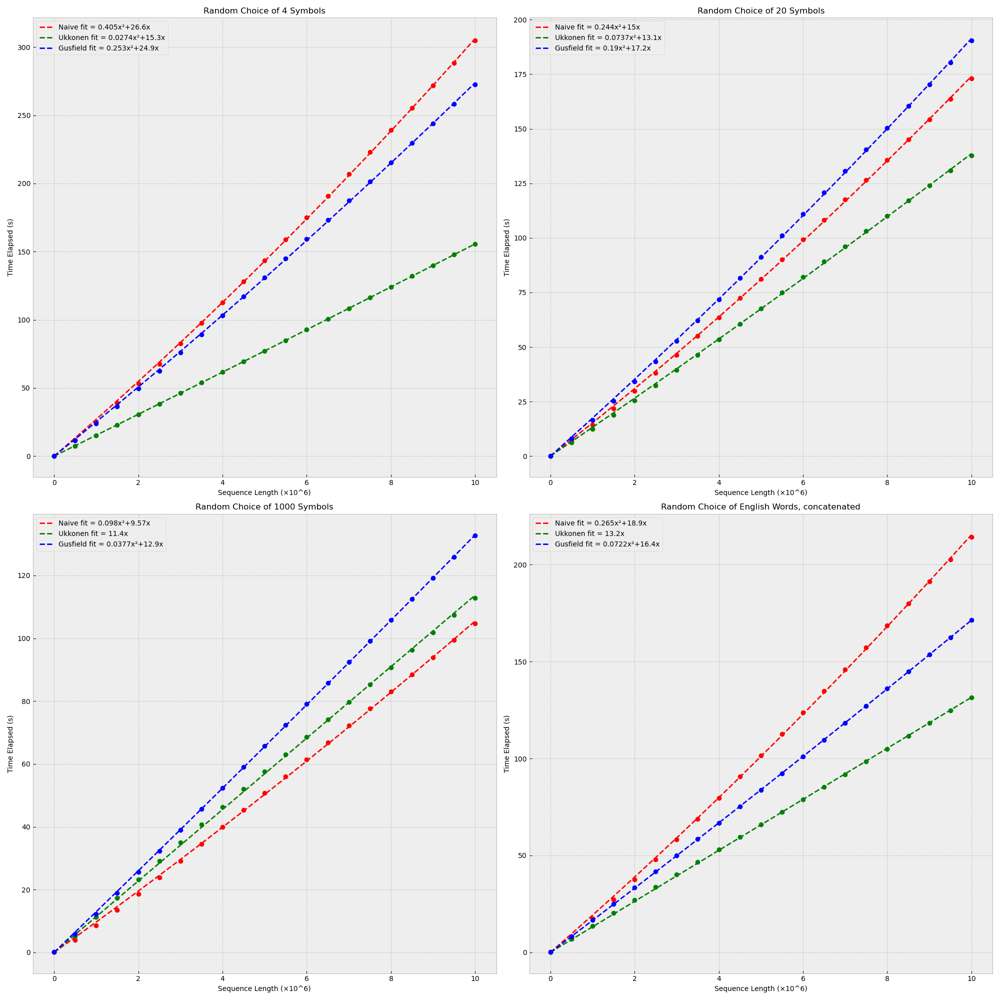

===========================
 A Generalized Suffix Tree
===========================

A Generalized Suffix Tree for any Python sequence, with Lowest Common Ancestor
retrieval.

.. code-block:: shell

   pip install suffix-tree

.. code-block:: python

   >>> from suffix_tree import Tree

   >>> tree = Tree({"A": "xabxac"})
   >>> tree.find("abx")
   True
   >>> tree.find("abc")
   False

This suffix tree:

- works with any Python sequence, not just strings, if the items are hashable,
- is a generalized suffix tree for sets of sequences,
- is implemented in pure Python,
- builds the tree in linear time with Ukkonen's algorithm,
- does constant-time Lowest Common Ancestor retrieval.

Three different builders have been implemented:

- one that follows Ukkonen's original paper ([Ukkonen1995]_),
- one that follows Gusfield's variant ([Gusfield1997]_),
- and one simple naive algorithm.

Being implemented in Python this tree is not very fast nor memory efficient.  The
building of the tree takes time proportional to the length of the string of symbols.
The query time is proportional to the length of the query string.  You can get a rough
idea of the performance under: `Time Complexity`_.  To get the best performance run with
python -O.

PyPi: https://pypi.org/project/suffix-tree/

Usage examples:
===============

.. code-block:: python

   >>> tree = Tree()
   >>> tree.add(1, "xabxac")
   >>> tree.add(2, "awyawxawxz")
   >>> tree.find("abx")
   True
   >>> tree.find("awx")
   True
   >>> tree.find("abc")
   False

.. code-block:: python

   >>> tree = Tree({"A": "xabxac", "B": "awyawxawxz"})
   >>> tree.find_id("A", "abx")
   True
   >>> tree.find_id("B", "abx")
   False
   >>> tree.find_id("B", "awx")
   True

.. code-block:: python

   >>> tree = Tree(
   ...     {
   ...         "A": "sandollar",
   ...         "B": "sandlot",
   ...         "C": "handler",
   ...         "D": "grand",
   ...         "E": "pantry",
   ...     }
   ... )
   >>> for k, length, path in tree.common_substrings():
   ...     print(k, length, path)
   ...
   2 4 s a n d
   3 3 a n d
   4 3 a n d
   5 2 a n

.. code-block:: python

   >>> tree = Tree({"A": "xabxac", "B": "awyawxawxz"})
   >>> for C, path in sorted(tree.maximal_repeats()):
   ...     print(C, path)
   ...
   1 a w
   1 a w x
   2 a
   2 x
   2 x a

Time Complexity
===============

.. _time-complexity:

References
==========

.. [Ukkonen1995] Ukkonen, Esko.  On-line construction of suffix trees.  1995.
                 Algorithmica 14:249-60.
                 http://www.cs.helsinki.fi/u/ukkonen/SuffixT1withFigs.pdf

.. [Gusfield1997] Gusfield, Dan.  Algorithms on strings, trees, and sequences.
                  1997.  Cambridge University Press.
